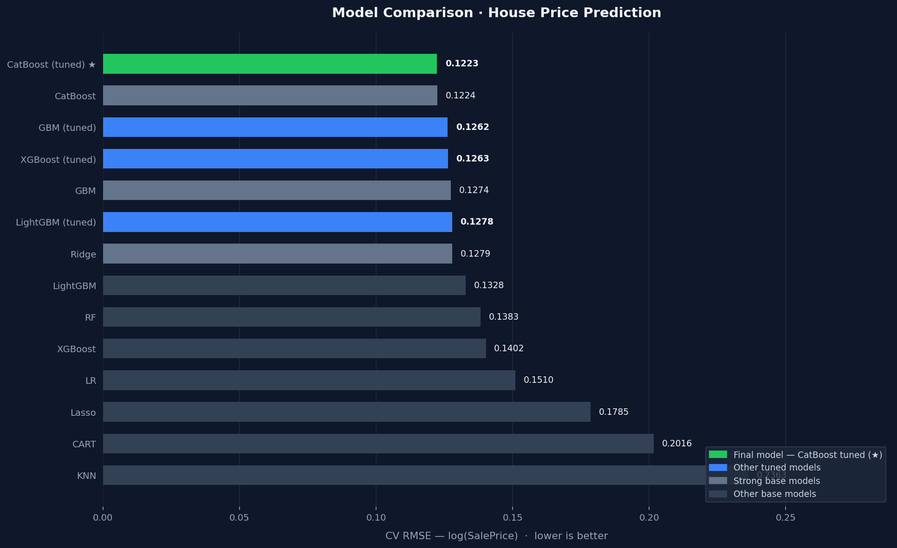

# house-price-prediction
End-to-end house price prediction pipeline using advanced regression techniques, including data preprocessing, feature engineering, and model comparison.

## 📌 Overview

This project tackles the [House Prices: Advanced Regression Techniques](https://www.kaggle.com/competitions/house-prices-advanced-regression-techniques) Kaggle competition. The goal is to predict residential home sale prices in Ames, Iowa using 79 explanatory features covering almost every aspect of a house.

The pipeline includes thorough exploratory data analysis, feature engineering, outlier & missing value handling, and a tuned CatBoost model selected after benchmarking 10 base models and tuning the top 4.

---

## 📊 Model Results

### Base Model Benchmarking (5-fold CV)

| Model             | CV RMSE |
|-------------------|---------|
| KNN               | 0.2363  |
| Decision Tree     | 0.2016  |
| Lasso             | 0.1785  |
| Linear Regression | 0.1510  |
| XGBoost           | 0.1402  |
| Random Forest     | 0.1383  |
| LightGBM          | 0.1328  |
| Ridge             | 0.1279  |
| GBM               | 0.1274  |
| CatBoost          | 0.1224  |

### Hyperparameter Tuning (GridSearchCV · 5-fold CV)

| Model              | Tuned RMSE |
|--------------------|------------|
| LightGBM           | 0.1278     |
| XGBoost            | 0.1263     |
| GBM                | 0.1262     |
| **CatBoost ★**     | **0.1223** |

> ★ Selected as final model. A VotingRegressor combining all four tuned models was also tested (RMSE: 0.1222) but provided no meaningful improvement — all models belong to the same gradient boosting family, resulting in low diversity.



---

## 🗂️ Project Structure

```
house-price-prediction/
│
├── data/                         # Pickle checkpoints between steps
│   ├── df_step1.pkl              # After EDA
│   ├── df_step2.pkl              # After preprocessing
│   └── df_step3.pkl              # After feature engineering (model input)
│
├── 01-eda.ipynb                  # Exploratory Data Analysis
├── 02-preprocessing.ipynb        # Missing values, outliers, rare encoding
├── 03-features_engineering.ipynb # New feature creation & encoding
├── 04-modeling.ipynb             # Model training, tuning & submission
│
├── utils.py                      # Shared helper functions (grab_col_names etc.)
├── submission.csv                # Kaggle submission file
├── model_comparison.png          # Model RMSE bar chart
└── README.md
```

---

## 🔬 Methodology

### 1 · Exploratory Data Analysis
- Shape, dtypes, missing value overview
- Categorical & numerical variable distributions
- Target variable (`SalePrice`) analysis — applied **log1p** transformation to correct right skew
- Correlation heatmap & highly correlated feature detection

### 2 · Preprocessing
- Features with structural `NaN` (e.g. `Alley`, `PoolQC`, `Fence`) filled with `"No"` to indicate absence
- Remaining categoricals filled with **mode**, numerics with **median**
- **Rare encoding**: categories appearing in <1% of observations collapsed into `"Rare"`
- **Outlier suppression**: IQR-based capping on all numeric features (except `SalePrice`)

### 3 · Feature Engineering
- Ordinal quality/condition columns mapped to numeric scale (`Ex`→5 … `No`→0)
- **17 new features** created, including:
  - `TotalQual` — aggregate quality score across 14 quality columns
  - `NEW_TotalHouseArea` — combined floor + basement area
  - `NEW_HouseAge`, `NEW_RestorationAge`, `NEW_GarageSold` — time-based features
  - Ratio features: `NEW_LotRatio`, `NEW_RatioArea`, `NEW_MasVnrRatio`
- Label encoding for binary categoricals, one-hot encoding for the rest
- Dropped low-signal features: `Street`, `Alley`, `Utilities`, `PoolQC`, `MiscFeature`, `Neighborhood`

### 4 · Modeling
- **Base model benchmarking**: 10 models compared with 5-fold CV
- **Hyperparameter tuning**: `GridSearchCV` on LightGBM, GBM, XGBoost, and CatBoost (top 4 from benchmarking)
- **Final model**: Tuned CatBoost — best single-model RMSE of **0.1223**
- Predictions inverse-transformed with `np.expm1` before submission

---

## ⚙️ Installation

```bash
# Clone the repository
git clone https://github.com/your-username/house-price-prediction.git
cd house-price-prediction

# Create virtual environment (optional but recommended)
python -m venv venv
source venv/bin/activate  # Windows: venv\Scripts\activate

# Install dependencies
pip install -r requirements.txt
```

### `requirements.txt`
```
numpy
pandas
matplotlib
seaborn
scikit-learn
lightgbm
xgboost
catboost
jupyter
```

---

## 🚀 Usage

Run the notebooks **in order**:

```bash
jupyter notebook
```

| Step | Notebook | Output |
|------|----------|--------|
| 1 | `01-eda.ipynb` | `data/df_step1.pkl` |
| 2 | `02-preprocessing.ipynb` | `data/df_step2.pkl` |
| 3 | `03-features_engineering.ipynb` | `data/df_step3.pkl` |
| 4 | `04-modeling.ipynb` | `submission.csv` |


---

## 🛠️ Tech Stack

- **Language**: Python 3.10+
- **Data**: pandas, numpy
- **Visualization**: matplotlib, seaborn
- **Modeling**: scikit-learn, LightGBM, XGBoost, CatBoost
- **Environment**: Jupyter Notebook
